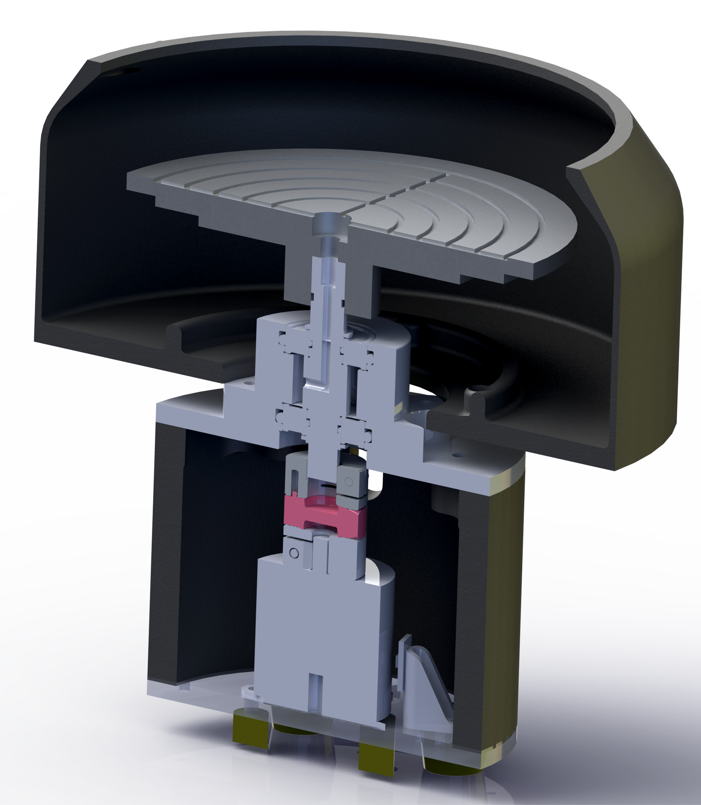

Spin coater
====

Repository for cphnano's DIY spin coater, for spin coating substrates up to 6".
This repository consists of 3 parts: 
 - spinner_firmware/
   
   This folder contains the arduino-based firmware for controlling the spinner.
   
 - spinner_software/
  
   This folder contains a simple client software for starting, stopping, monitoring and logging spin processes.
 
 - spinner_hardware/
 
   This folder contains CAD files for building the spin coater. 
   

Getting started
-------
**Warning: Spin coaters are dangerous!**
Use at your own risk.
Always take proper safety precautions when working with spinning machines. Cphnano does not take any responsibility for any damages or injuries caused by using the information in this repository. 

 - Start by building the spinner. All the required information can be found in the 'spinner_hardware' folder. If you don't have the resources available  then you can contact 'info@cphnano.com' and we might be able to help you. 
 - Once the hardware has been built, flash the firmware onto the microcontroller. Firmware can be found in the 'spinner_firmware' folder. 
 - Now you should have a functioning spin coater which can be controlled using the software found in 'spinner_software'. 
